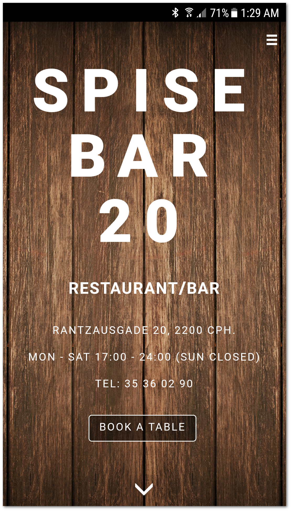

# Spise/Bar 20 Website

> [Spise/Bar20](http://sb20.dk/) restaurant website with a wood theme flavour

* The website is also live on restaurant's domain at http://sb20.dk/

# Features

Aside from the nice looking, responsive design, the website includes the feature of **updating** the restaurant food menu. On the */admin* route, the restaurant employees are able to quickly edit the menu.

Using [php](http://php.net/manual/en/intro-whatis.php), we write the changes to a `data` file. When the website loads, it pulls the menu from `data` using an [Ajax](http://api.jquery.com/jquery.ajax/) call. This way they can update the web menu without the need of a person to overwrite the source files.

# Technologies

* [HTML, CSS, JavaScript](https://developer.mozilla.org/en-US/docs/Web/HTML) - The devil's three-way !web-version! that sits in the root of every website

* [jQuery](https://jquery.com/) - widely used JavaScript library that simplifies JS usage

* [Bootstrap](http://getbootstrap.com/) - CSS/JS framework, makes it easy to develop responsive, well polished websites

* [Php](http://php.net/manual/en/intro-whatis.php) - scripting language which was used manage restaurant menu data | more about it under here

# Motivation

This is a school project, that consists in building a product for a real company. So our team found this cozy restaurant that was in need of a presentation website and took the challenge.

> *Update*: The company was happy with our product and decided to use it as their presentation website. So proud! You can check it out at http://sb20.dk/

